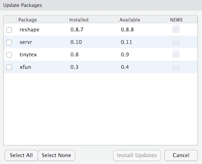
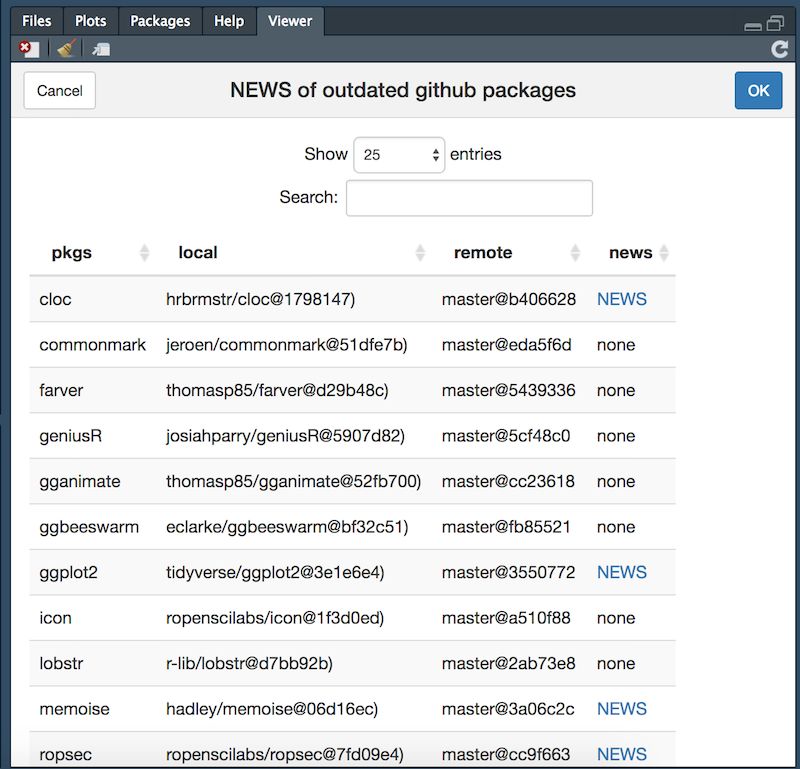

# upnews

[](https://travis-ci.org/ginolhac/upnews)
[](https://codecov.io/github/ginolhac/upnews?branch=master)

**Display news and upgrade outdated GitHub packages**

## Motivation

Get a similar output as the RStudio **Update** button for CRAN packages, but for GitHub ones.



## Installation

You can install the released version of upnews from [github](https://github.com/ginolhac/upnews)

### Console version

``` r
if (!requireNamespace("remotes")) install.packages("remotes")
remotes::install_github("ginolhac/upnews")
```

### With add-in

``` r
if (!requireNamespace("remotes")) install.packages("remotes")
remotes::install_github("ginolhac/upnews", dependencies = TRUE)
```

## Procedure

This add-in will fetch the remote `HEAD sha1` of local github packages and compare them, to the remote `HEAD` (same branch). 
If some packages are outdated, fetch and display a link to a NEWS file (case insensitive `NEWS.md`).
If the `Ref` is a commit, all branches are tested to find out from which branch it originate from.

## Usage and ouput

### Console

``` r
> upnews::upnews()
fetching 23 distant sha1
   |++++++++++++++++++++++++++++++++++++++++++++++++++| 100% elapsed = 05s
4 outdated pkgs (23 gh pkgs)
fetching news...
no news for jeroen/credentials/master
# A tibble: 4 x 7
  pkgs               loc_version gh_version local          remote         date       news                                                           
* <chr>              <chr>       <chr>      <chr>          <chr>          <chr>      <chr>                                                          
1 ginolhac/bifag     0.1.3.990   0.1.3.990  master@d490355 master@362992a 2018-11-07 https://raw.githubusercontent.com/ginolhac/bifag/master/NEWS.md
2 jeroen/credentials 0.1         0.1        master@c9a4197 master@e1b2d9d 2018-11-13 NA                                                             
3 r-lib/pkgbuild     1.0.2.9000  1.0.2.9000 master@aec4654 master@6e4ebdf 2018-10-28 https://raw.githubusercontent.com/r-lib/pkgbuild/master/NEWS.md
4 tidyverse/rlang    0.3.0.9000  0.3.0.9000 master@f6a719a master@b8566db 2018-11-14 https://raw.githubusercontent.com/r-lib/rlang/master/NEWS.md
```

### RStudio add-in

- use the **upnews** link in the _Addins_ menu.
- in the console, a progress bar display the retrieval of remote HEAD
- finally a [`DataTable`](https://rstudio.github.io/DT/) output in the viewer is displayed such as:



- the package name has a pophover text with `user/pkg` and a link to the GitHub repo
- local version is from the DESCRIPTION local file, and a pophover text displays `branch/commit`
- remote version is from the DESCRIPTION remote file, and a pophover text displays `branch/commit`

### increase limits to the GITHUB API

If you need more request to the GitHub API, you must be authenticated. Then, the limit
is **5,000** requests per hour instead of **60**.

To authenticate yourself, you can follow the great [happygitwithr](http://happygitwithr.com) bookdown by Jenny Bryan. The specific chapter about the `GITHUB_PAT` env variable is [here](http://happygitwithr.com/github-pat.html). Brefly:

- create a token with no rights on GitHub
- write this token in your `~/.Renviron` file
- from a fresh R session, check you registered token with `Sys.getenv("GITHUB_PAT")`


### Related packages

[@Pakillo](https://github.com/Pakillo) recently made me aware of this similar package [dtupdate](https://github.com/hrbrmstr/dtupdate) by Bob Rudis. It has no add-in plus a dependency to `dplyr` but must be more stable than this one.

### Acknowledgements

- this [SO answer](https://stackoverflow.com/a/23970412/1395352) for fixing the issue with commit sha as reference
- [regexplain](https://github.com/gadenbuie/regexplain) by @gabenbuie for inspiration in the addin design
- [addinslist](https://github.com/daattali/addinslist) by @daattali for inspiration in the addin design
- [remotes](https://github.com/r-lib/remotes/blob/master/tests/testthat/test-install-github.R) for appropriate testing
- @koncina and @Pakillo for testing and suggestions

### TODO

- smarter search for news
- knit NEWS.md and display in Viewer pane
- use `cli` for console output
- is it useful since `remotes` v2.0.1 allows an interactive upgrade?

