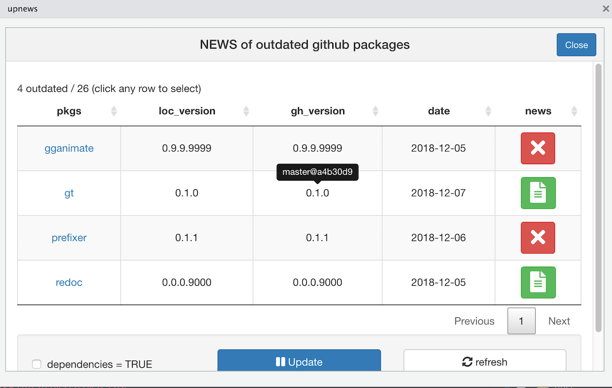

# upnews

Display news for outdated github packages

## Motivation

Get a similar output as the RStudio **Update** button for CRAN packages, but for GitHub ones.


## Installation

You can install the released version of upnews from [github](https://github.com/ginolhac/upnews) with:

``` r
remotes::install_github("ginolhac/upnews")
```

## Procedure

This add-in will fetch the remote `HEAD sha1` of local github packages and compare them, to the remote `HEAD` (same branch). 
If some packages are outdated, fetch and display a link to a NEWS file (case insensitive `NEWS.md`).

## RStudio add-in

- use the **upnews** link in the _Addins_ menu.
- in the console, a progress bar display the retrieval of remote HEAD
- finally a `DT` output in the viewer is displayed such as:



## TODO

- smarter search for news 
- add tests
- use `cli` for console output
- if this very useful since `remotes` v2.0.1 that allows an interactive upgrade?

